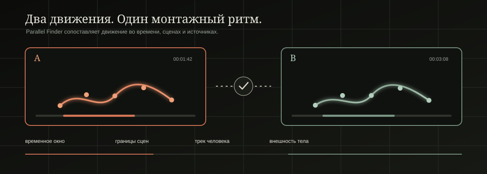

<div align="center">

# Parallel Finder

### Находит монтажные параллели по движению человека — локально, по таймкодам и без загрузки видео в облако.

<p>
  
  
  
  <a href="LICENSE"></a>
  
</p>

[Возможности](#что-делает) · [Быстрый старт](#быстрый-старт) · [Модели](#модели-и-вычисления) · [Как это работает](#как-это-работает) · [Сборка](#сборка-из-исходников) · [Документация](#документация)

</div>

---

<p align="center">
  
</p>

> **Не поиск похожих скриншотов.** Parallel Finder ищет устойчивые фрагменты
> движения: учитывает позу, время, сцену, трек человека и внешность тела.
> Результат — две точки A/B с таймкодами, которые можно проверить глазами или
> нарезать в MP4.

## Что делает

| На монтажном столе | Внутри приложения |
| --- | --- |
| Добавить материал | Одиночные видео или папка с роликами |
| Найти параллели | Движение, статические позы, клипы или смешанный проход |
| Проверить результат | Два крупных preview A/B, таймкоды, source и track ID |
| Отобрать лучшее | Сортировка, выбор нескольких пар, подавление дублей |
| Передать в монтаж | JSON, CSV, TXT или MP4-нарезка выбранных фрагментов |

Видео, кадры и результаты остаются на компьютере. Сеть нужна только тогда,
когда пользователь сам скачивает модель или runtime.

## Быстрый старт

### 1. Добавьте видео

Нажмите **«Добавить видео»** или **«Выбрать папку»**. Приложение принимает
`mp4`, `mov`, `mkv`, `avi`, `webm` и `m4v`.

### 2. Выберите режим

| Режим | Когда использовать |
| --- | --- |
| **Движение** | Нужны рифмы жестов, походки, поворота, действия. Это рекомендуемый старт. |
| **Статические кадры** | Ищете осознанно похожие позы или композицию, даже без движения. |
| **Клипы** | Нужны более длинные монтажные переклички. |
| **Движение + кадры** | Два независимых прохода, когда важны оба типа совпадений. |

### 3. Запустите анализ

Выберите профиль **Быстрый поиск**, **Баланс** или **Высокая точность**. Для
неочевидных настроек есть пояснения при наведении: они объясняют эффект, а не
внутреннее название алгоритма.

### 4. Проверьте и экспортируйте

Выберите результат справа, сравните A/B, отметьте нужные пары и экспортируйте
таблицу либо MP4-клипы. Точный экспорт перекодирует границы кадра; быстрый
копирует поток и может начинаться с ближайшего ключевого кадра.

## Как это работает

```text
видео
  │
  ├─ декодирование и границы сцен
  ├─ YOLO pose → люди и ключевые точки
  ├─ trackId → не смешивать людей внутри одного источника
  ├─ body-ReID → дополнительный фильтр внешности между сценами и видео
  ├─ временные окна → не один «удачный» кадр, а серия поз
  └─ candidate index → DTW → temporal gate → NMS → ранжирование
                                                       │
                                             A/B preview + экспорт
```

### Что намеренно не считается совпадением

- Один похожий кадр без устойчивой временной последовательности.
- Разные `trackId` в одном источнике.
- Два окна из одной и той же сцены.
- Неподвижный шум в режиме «Движение».
- Межперсонажная пара без доступной body-ReID модели.

`ReID · внешность похожа (96%)` — это сходство векторов внешнего вида тела,
а не биометрическое подтверждение личности. Финальный выбор всегда остаётся
за монтажёром.

## Модели и вычисления

### Pose-модели

Приложение использует ONNX pose-модели. В селекторе показаны 15 публикуемых
вариантов YOLOv8, YOLO11 и YOLO26 — от `nano` до `xlarge`. Если выбранной
модели нет, приложение получает `manifest.json`, скачивает файл в `.part`,
сверяет размер и SHA-256 и только затем устанавливает её в:

```text
%LocalAppData%\ParallelFinder\models
```

На машине разработчика исходные pose-веса находятся здесь:

```text
D:\YOLO_Download_Project\models
```

Это рабочая папка подготовки, а не путь, который требуется пользователю.
`.pt` не добавляются в Git: в GitHub попадают только ONNX assets GitHub
Release и `manifest.json`.

> **Состояние публикации:** release bundle из 15 pose-моделей подготовлен и
> проверен локально. Пока GitHub Release не опубликован, кнопка скачивания на
> чистом компьютере корректно сообщит, что проверенный manifest недоступен.

Для публикации подготовленного набора:

```powershell
powershell -ExecutionPolicy Bypass `
  -File D:\Parallel-Finder\tools\release\publish-model-release.ps1 `
  -Tag v0.1.0
```

Скрипт не загрузит asset, если его размер или SHA-256 не совпадает с manifest.
Нужны GitHub CLI (`gh`) и авторизация владельца репозитория.

### Провайдеры

| Выбор | Для чего | Важно |
| --- | --- | --- |
| **Auto** | Обычный запуск | Выбирает доступный backend после проверки. |
| **DirectML** | AMD, Intel, NVIDIA | Нужен ONNX Runtime с DirectML EP. |
| **CUDA** | NVIDIA | Нужны CUDA EP, драйвер и совместимые DLL. |
| **TensorRT** | NVIDIA, максимальная скорость | Нужны TensorRT, CUDA и совместимый ONNX Runtime. |
| **CPU** | Любой компьютер | Медленнее, но не требует GPU. |

Ручной выбор не подменяется молча на CPU. Если runtime недоступен, приложение
показывает причину и предлагает скачать совместимый пакет, когда такой пакет
опубликован в Release.

Подробнее: [модели](docs/models.md) и [GPU runtime](docs/provider-runtime.md).

## Сборка из исходников

### Требования

- Windows 10/11;
- MSYS2 UCRT64;
- CMake 3.25+, Ninja, GCC;
- Qt 6.5+ (`base`, `declarative`, `shadertools`);
- FFmpeg и ONNX Runtime.

```bash
cmake --preset ucrt64-release
cmake --build --preset ucrt64-release
```

Готовое приложение:

```text
build\ucrt64-release\ParallelFinder.exe
```

Проверка без открытия окна:

```bash
ParallelFinder.exe --pf-smoke
```

### Локальная проверка

```bash
cmake --preset ucrt64-debug
cmake --build --preset ucrt64-debug
ctest --preset ucrt64-debug --output-on-failure

cmake --preset ucrt64-release
cmake --build --preset ucrt64-release
ctest --preset ucrt64-release --output-on-failure
```

Тесты намеренно не входят в Git-историю этого проекта. Поэтому локальный
`ctest` подтверждает работу checkout разработчика, но не заменяет ручную
проверку GPU, реального видео и DPI перед выпуском.

## Структура проекта

```text
app/                 запуск Windows-приложения
core/                декодирование, сцены, трекинг, matcher и ranking
gpu/                 ONNX Runtime, pose и body-ReID
services/            кэш, загрузка моделей/runtime, FFmpeg
exporters/           JSON, CSV, TXT и экспортные форматы
ui/qml/              интерфейс Qt Quick
ui/src/              bridge между QML и C++
tools/model_export/  экспорт ONNX и генерация manifest
tools/release/       проверенная публикация Release assets
docs/                решения, ограничения и инструкции
```

## Ограничения, о которых стоит знать

- Результат matcher — кандидат для просмотра, а не готовое монтажное решение.
- Качество body-ReID ещё не измерено на размеченном identity-наборе.
- CUDA, TensorRT и DirectML нужно проверять на конкретной видеокарте и
  версии драйвера.
- Первый полный прогон длинного 4K-видео на CPU может быть долгим.
- Offscreen QML smoke не заменяет ручной осмотр на 100/125/150/200% DPI.

Полный список проверенных и непроверенных вещей находится в
[аудите проекта](docs/full-audit.md).

## Документация

- [Модели и GitHub Release](docs/models.md)
- [GPU runtime и совместимость](docs/provider-runtime.md)
- [Как устроен matcher](docs/matcher-references.md)
- [UI audit](docs/ui-audit.md)
- [Полный технический аудит](docs/full-audit.md)
- [Правила участия](CONTRIBUTING.md)

## Лицензия

Код распространяется по [AGPL-3.0](LICENSE). Лицензии ONNX Runtime, Qt,
FFmpeg, CUDA, TensorRT и весов моделей нужно проверять отдельно перед
публикацией portable-сборки.
