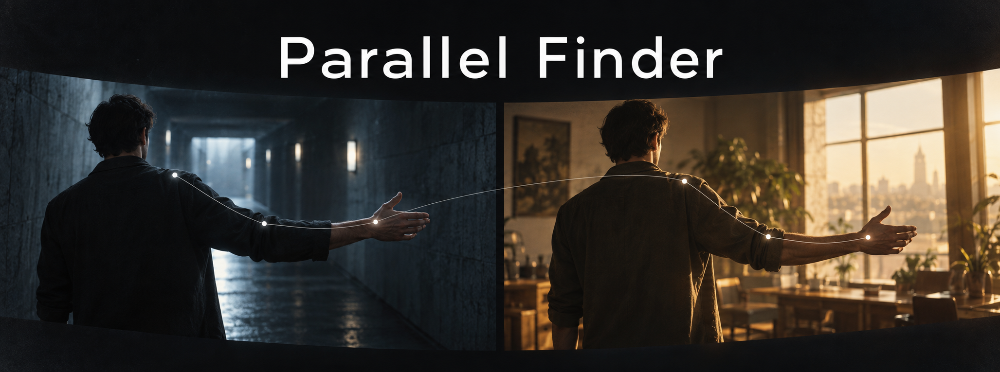

<div align="center">



**Найди повтор движения. Сравни два момента. Забери их в монтаж.**

[](#установка)
[](#сборка)
[](#сборка)
[](LICENSE)

[Скачать](https://github.com/Pozit1vchic/Parallel-Finder/releases) · [Начать](#первый-запуск) · [Выбрать модель](#какую-модель-выбрать) · [Ускорение](#cpu-directml-cuda-и-tensorrt) · [Ограничения](#честно-о-результатах)

</div>

<sub>Обложка — концептуальная иллюстрация, не скриншот результата анализа.</sub>

Parallel Finder помогает искать монтажные параллели: моменты, в которых персонаж повторяет движение или принимает похожую позу. Видео обрабатывается локально. Найденные пары — **кандидаты для просмотра**, а не автоматически подтверждённые совпадения.

> Проект проходит подготовку к релизу. Проверенное состояние, известные ошибки и оставшиеся проверки — в [AUDIT.md](AUDIT.md). Наличие сборки не означает, что качество поиска доказано для любого видео.

## Установка

Сборки публикуются в [GitHub Releases](https://github.com/Pozit1vchic/Parallel-Finder/releases). Выбирайте файлы приложения, не архивы исходников GitHub.

| Вариант | Как запустить |
|---|---|
| **Portable ZIP** | Распакуйте **весь** архив в отдельную доступную для записи папку. Запустите `ParallelFinder.exe`. Не запускайте EXE внутри ZIP и не переносите его отдельно от DLL. |
| **Setup EXE** | Запустите установщик и выберите папку. Он добавляет приложение в меню «Пуск» и предоставляет удаление. |

Windows x64. Python, Visual Studio и CUDA Toolkit для обычного запуска не нужны. Portable означает запуск без установщика; настройки и загруженные модели могут сохраняться в пользовательской папке AppData. Точный путь к кэшу отображается в настройках.

Неподписанная сборка может вызвать предупреждение SmartScreen. Проверяйте источник и SHA-256 из релиза; отключать защиту Windows не требуется. Модели и дополнительные ускорители могут распространяться отдельно.

## Первый запуск

1. **Добавьте видео** кнопкой, перетаскиванием или выберите папку.
2. В левой панели раскройте **«Дополнительные настройки»** и выберите pose-модель. Если модель отсутствует, нажмите вариант с отметкой скачивания и дождитесь завершения.
3. Для первого прохода выберите **«Баланс»** и **«Движение + кадры»**. Если нужны только повторяющиеся жесты, выберите **«Движение»**.
4. Нажмите **«Запустить анализ»**. Первый проход может быть заметно дольше повторного: приложение сохраняет промежуточные результаты в кэш.
5. Выберите пару справа. **↑ / ↓** переключают результаты, галочка выбирает пару для экспорта.
6. Проверьте оба момента в исходном видео перед окончательным отбором.

Видео не отправляется на сервер. Интернет требуется для скачивания отсутствующих моделей и пакетов ускорения.

## Какую модель выбрать

Нужна **pose-модель в формате ONNX**. Обычная модель детекции объектов или исходный файл `.pt` не заменяют pose-экспорт.

| Размер | Когда выбирать | Компромисс |
|---|---|---|
| **n / nano** | Первичная проверка, слабый компьютер | Быстрее, но мелкие и перекрытые суставы могут определяться хуже |
| **s / small** | Повседневный поиск при ограниченных ресурсах | Умеренная нагрузка |
| **m / medium** | Начальная точка для проверки качества | Больше вычислений; не гарантирует больше правильных пар |
| **l / large**, **x / xlarge** | Сложные кадры и запас памяти GPU | Медленнее и требовательнее; улучшение проверяйте на своём видео |

В каталоге есть варианты YOLOv8, YOLO11 и YOLO26. Размер модели и поколение — разные параметры: самая новая или самая большая модель не обязательно лучше для конкретного сценпака.

Выбор отсутствующей модели запускает загрузку только при наличии опубликованного `manifest.json` и соответствующего файла. Размер и SHA-256 проверяются до установки. Если приложение сообщает, что манифест недоступен, модель ещё не опубликована либо загрузке мешает сеть — повторный анализ это не исправит.

**Режим точности** меняет параметры отбора совпадений. **Обработка кадров** меняет частоту анализа. Это не выбор разрешения исходного видео: рабочие кадры для vision-анализа ограничены 720p; оригинал остаётся неизменным.

### Персонажи в масках

В левой панели, рядом с **«Учитывать зеркальные позы»**, включите **«Костюм / маска»** для закрытых лиц. Приложение сравнивает внешний вид тела и движения без распознавания лица.

Одинаковые костюмы у разных людей могут быть неразличимы. Режим не определяет, какой актёр находится под маской, и не гарантирует объединение персонажа в маске и без неё.

## Режимы поиска

| Режим | Что сравнивает |
|---|---|
| **Движение** | Изменение позы во времени |
| **Статические кадры** | Похожие видимые позы, без требования повторения движения |
| **Клипы 4 с** | Более длинные временные окна |
| **Движение + кадры** | Кандидаты обоих типов |

Для крупных планов результат может быть помечен **«Похожее положение головы»**: это не сравнение всего тела. Сходство лица используется как дополнительный признак, а не как доказательство повторения движения.

## Экспорт

Отметьте пары и нажмите **«Экспорт»**.

- **JSON / CSV / TXT** — таймкоды, источники и данные для дальнейшей обработки.
- **FFMPEG** — отдельные MP4-файлы A и B. Фрагменты ограничены границами найденного кадра/сцены и максимальной длиной 25 секунд.
- **Точно** — перекодирование с более точными границами, медленнее.
- **Быстро** — копирование потока; границы зависят от ключевых кадров.
- **Как в видео** — порядок по источнику и времени. **По сортировке** — порядок результатов.

Укажите папку и префикс имени. MP4-экспорт выполняется в фоне; повторный запуск заблокирован до завершения. Не закрывайте приложение до окончания экспорта.

## CPU, DirectML, CUDA и TensorRT

| Режим | Оборудование и условия |
|---|---|
| **CPU** | Работает без GPU-ускорителя; может быть медленным |
| **DirectML** | Совместимая видеокарта AMD, Intel или NVIDIA и DirectML runtime |
| **CUDA** | NVIDIA, совместимый драйвер, ONNX Runtime CUDA и согласованные зависимости |
| **TensorRT** | Поддерживаемая NVIDIA и совместимые TensorRT/CUDA/ONNX Runtime; первая подготовка модели может занять время |
| **Auto** | Выбор из доступных провайдеров |

Кнопка **«Скачать runtime»** работает только для опубликованного проверенного пакета. После установки может потребоваться перезапуск приложения: уже загруженную DLL ONNX Runtime нельзя безопасно заменить на лету.

CUDA/TensorRT не являются универсальной гарантией ускорения всего анализа: декодирование, поиск кандидатов и подготовка данных тоже занимают время. Сравнивайте один ролик, одну модель и одинаковые настройки; не сравнивайте холодный запуск с проходом из кэша.

[Подготовка пакетов NVIDIA для разработчика](docs/runtime-distribution.md).

## Честно о результатах

- Проценты «точности совпадения» не показываются: внутренняя оценка ранжирования не является вероятностью. Исходное числовое поле в экспорте также нельзя трактовать как процент правильности.
- Маленькое лицо, маска, перекрытия, монтажные склейки и похожая одежда затрудняют поиск.
- Соседние похожие кадры одной локации подавляются эвристикой; возможны как пропуски, так и ложные совпадения.
- На текущем контрольном ролике найдены **2 из 3** заданных положительных параллелей; пять заданных отрицательных пар исключены. Это не оценка точности на всех видео.
- Проверка на разных NVIDIA GPU, длительные стресс-тесты и полный лицензионный аудит дистрибутива ещё необходимы перед стабильным публичным выпуском.

## Сборка

MSYS2 UCRT64, CMake 3.25+, GCC с C++23, Ninja, Qt 6.8+, FFmpeg, ONNX Runtime и GoogleTest.

```bash
cmake --preset ucrt64-release
cmake --build --preset ucrt64-release
ctest --preset ucrt64-release --output-on-failure
```

Приложение: `build/ucrt64-release/ParallelFinder.exe`. Проверка запуска без UI: `ParallelFinder.exe --pf-smoke`. Тесты входят в репозиторий; тесты ядра не заменяют проверку качества на размеченных видео.

## Для разработчиков

[Аудит](AUDIT.md) · [Проверка матчера](docs/matcher-validation.md) · [Модели](models/README.md) · [Подготовка релиза](tools/release/README.md) · [Участие](CONTRIBUTING.md)

Код проекта — [AGPL-3.0](LICENSE). У библиотек, шрифтов и весов моделей свои лицензии. Пакеты CUDA/TensorRT не входят в исходники и не должны публиковаться без проверки прав распространения.
