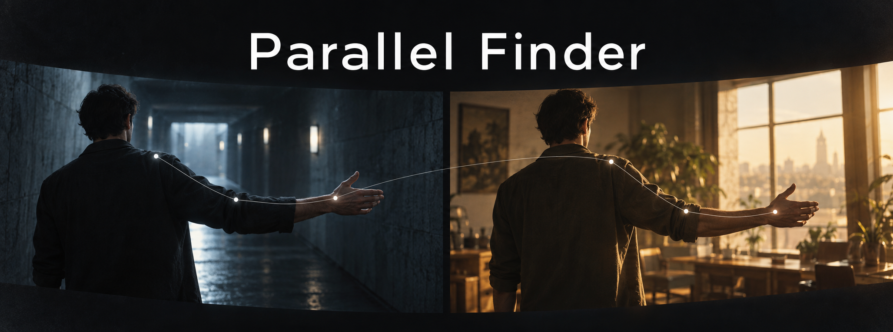

<div align="center">



**Найди повтор движения. Сравни два момента. Забери их в монтаж.**

[](#установка)
[](#сборка)
[](#сборка)
[](LICENSE)

[Скачать](https://github.com/Pozit1vchic/Parallel-Finder/releases) · [Начать](#первый-запуск) · [Выбрать модель](#какую-модель-выбрать) · [Ускорение](#cpu-directml-cuda-и-tensorrt) · [Ограничения](#честно-о-результатах)

</div>

<sub>Обложка — концептуальная иллюстрация, не скриншот результата анализа.</sub>

Parallel Finder помогает искать монтажные параллели: моменты, в которых персонаж повторяет движение или принимает похожую позу. Видео обрабатывается локально. Найденные пары — **кандидаты для просмотра**, а не автоматически подтверждённые совпадения.

> Текущая локально проверенная сборка — **0.1.0-rc.7**. Версия видна в заголовке окна. Актуальный аудит от 30 сентября 2026 и оставшиеся задачи — в [AUDIT.md](AUDIT.md).

## Установка

Сборки публикуются в [GitHub Releases](https://github.com/Pozit1vchic/Parallel-Finder/releases). Выбирайте файлы приложения, не архивы исходников GitHub.

| Вариант | Как запустить |
|---|---|
| **Portable ZIP** | Распакуйте **весь** архив в отдельную доступную для записи папку. Запустите `ParallelFinder.exe`. Не запускайте EXE внутри ZIP и не переносите его отдельно от DLL. |
| **Setup EXE** | Запустите установщик и выберите папку. Он добавляет приложение в меню «Пуск» и предоставляет удаление. |

Windows x64. Python, Visual Studio и CUDA Toolkit для обычного запуска не нужны. Portable означает запуск без установщика; настройки и загруженные модели могут сохраняться в пользовательской папке AppData. Точный путь к кэшу отображается в настройках.

Неподписанная сборка может вызвать предупреждение SmartScreen. Проверяйте источник и SHA-256 из релиза; отключать защиту Windows не требуется. Модели и дополнительные ускорители могут распространяться отдельно.

## Первый запуск

1. **Добавьте видео** кнопкой, перетаскиванием или выберите папку.
2. В левой панели раскройте **«Дополнительные настройки»**. По умолчанию выбрана **YOLO26 · medium**; далее приложение восстанавливает последнюю выбранную модель. `✓` означает, что файл найден, `↓` — что его нужно скачать. Выбор отсутствующей модели автоматически запускает загрузку; дождитесь её завершения.
3. Для первого прохода выберите **«Баланс»** и **«Гибрид (движение + кадры)»**. Если нужны только повторяющиеся жесты, выберите **«Движение»**.
4. Нажмите **«Запустить анализ»**. Первый проход может быть заметно дольше повторного: приложение сохраняет промежуточные результаты в кэш.
5. Выберите пару справа. **↑ / ↓** переключают результаты, галочка выбирает пару для экспорта.
6. У **каждой пары**, включая статичную позу и положение головы, можно запустить видео внутри панелей A/B. Кнопка под A управляет A, кнопка под B — B, общая **«Воспроизвести A/B»** запускает обе стороны. Повторное нажатие ставит воспроизведение на паузу; смена пары его останавливает. Отдельной кнопки «Повтор» нет. Статичное превью показывает до 4 секунд от найденного момента, в пределах сцены; движение — найденный отрезок.

Видео не отправляется на сервер. Интернет требуется для скачивания отсутствующих моделей и пакетов ускорения.

В настройках оформления список предлагает только установленные поддерживаемые шрифты. Inter и Montserrat не скачиваются автоматически: установите нужный шрифт в Windows или выберите свой `.ttf`/`.otf` через добавление шрифта. Если файл был перемещён или удалён, приложение покажет ошибку загрузки; выберите его заново. «Сбросить оформление» возвращает цвет, шрифт, прозрачность и анимации к значениям по умолчанию, не меняя язык и параметры анализа.

## Какую модель выбрать

Нужна **pose-модель в формате ONNX**. Обычная модель детекции объектов или исходный файл `.pt` не заменяют pose-экспорт.

| Размер | Когда выбирать | Компромисс |
|---|---|---|
| **n / nano** | Первичная проверка, слабый компьютер | Быстрее, но мелкие и перекрытые суставы могут определяться хуже |
| **s / small** | Повседневный поиск при ограниченных ресурсах | Умеренная нагрузка |
| **m / medium** | Начальная точка для проверки качества | Больше вычислений; не гарантирует больше правильных пар |
| **l / large**, **x / xlarge** | Сложные кадры и запас памяти GPU | Медленнее и требовательнее; улучшение проверяйте на своём видео |

В каталоге есть варианты YOLOv8, YOLO11 и YOLO26. Размер модели и поколение — разные параметры: самая новая или самая большая модель не обязательно лучше для конкретного сценпака.

Для начала используйте **YOLO26m-pose**: эта модель включена в текущий комплект приложения и использовалась в контрольных прогонах Soldier и Dean. Последний выбор сохраняется отдельно от пути к файлу. Установленная модель не загружается повторно; если выбранного файла нет, анализ блокируется до успешной загрузки. Возобновить неудавшуюся загрузку можно повторным выбором модели.

Выбор отсутствующей модели запускает загрузку только при наличии опубликованного `manifest.json` и соответствующего файла. Размер и SHA-256 проверяются до установки. Если приложение сообщает, что манифест недоступен, модель ещё не опубликована либо загрузке мешает сеть — повторный анализ это не исправит.

Модели хранятся в `%LocalAppData%\ParallelFinder\ParallelFinder\models`. Подготовка файлов, точный тег релиза и инструкция публикации — в [руководстве по моделям](docs/models.md).

**Режим точности** меняет параметры отбора совпадений. **Обработка кадров** меняет частоту анализа. Это не выбор разрешения исходного видео: рабочие кадры для vision-анализа ограничены 720p; оригинал остаётся неизменным.

### Персонажи в масках

Поиск рассчитан на **одного и того же человека или персонажа**: похожий жест другого человека сам по себе не считается подходящей параллелью. Для закрытых лиц в левой панели, рядом с **«Учитывать зеркальные позы»**, включите **«Костюм / маска»**. В этом режиме приложение использует внешний вид тела и движение без признаков лица, поэтому проверка личности менее надёжна.

Одинаковые костюмы у разных людей могут быть неразличимы. Режим не определяет, какой актёр находится под маской, и не гарантирует объединение персонажа в маске и без неё.

## Режимы поиска

| Режим | Что сравнивает |
|---|---|
| **Движение** | Изменение позы во времени |
| **Статические кадры** | Похожие видимые позы, без требования повторения движения |
| **Гибрид (движение + кадры)** | Кандидаты обоих типов |

Для крупных планов результат может быть помечен **«Похожее положение головы»**: это не сравнение всего тела. Сходство лица используется как дополнительный признак, а не как доказательство повторения движения.

## Экспорт

Отметьте пары и нажмите **«Экспорт»**.

- **JSON / CSV / TXT** — таймкоды, источники и данные для дальнейшей обработки.
- **FFMPEG** — отдельные MP4-файлы A и B. Фрагменты ограничены границами найденного кадра/сцены и максимальной длиной 25 секунд.
- **Точно** — перекодирование с более точными границами, медленнее.
- **Быстро** — копирование потока; границы зависят от ключевых кадров.
- **Как в видео** — порядок по источнику и времени. **По сортировке** — порядок результатов.

Укажите папку и префикс имени. MP4-экспорт выполняется в фоне; повторный запуск заблокирован до завершения. Не закрывайте приложение до окончания экспорта.

EDL, FCPXML и After Effects JSX реализованы в библиотеке экспортёров, но пока не доступны в текущем диалоге приложения.

## CPU, DirectML, CUDA и TensorRT

Для владельца проекта: [подготовка пакетов и публикация для кнопки скачивания](docs/provider-packages-howto.md). Большой TensorRT-пакет может скачиваться частями; для этого требуется обновлённая сборка приложения с поддержкой `parts`.

| Режим | Оборудование и условия |
|---|---|
| **CPU** | Работает без GPU-ускорителя; может быть медленным |
| **DirectML** | Совместимая видеокарта AMD, Intel или NVIDIA и DirectML runtime |
| **CUDA** | NVIDIA, совместимый драйвер, ONNX Runtime CUDA и согласованные зависимости |
| **TensorRT** | Поддерживаемая NVIDIA и совместимые TensorRT/CUDA/ONNX Runtime; первая подготовка модели может занять время |
| **Auto** | Выбор из доступных провайдеров |

**DirectML:** откройте Настройки → Анализ, выберите DirectML и нажмите **«Скачать компоненты»**. Приложение загрузит около 215 МБ из официального NuGet Microsoft, проверит SHA-256 и установит Windows x64 DLL в AppData. После установки закройте и снова откройте приложение. Нужны совместимые видеокарта DirectX 12 и драйвер.

**CUDA / TensorRT:** выберите провайдер в Настройки → Анализ и нажмите **«Скачать компоненты»**. Приложение читает каталог из отдельного релиза `runtime-v1`, проверяет размеры и SHA-256, устанавливает пакет в `%LocalAppData%\ParallelFinder\ParallelFinder\providers`. CUDA-пакет занимает около **1,65 ГБ**, TensorRT — **3,30 ГБ** и загружается двумя частями. После установки полностью закройте и снова откройте приложение. Драйвер NVIDIA устанавливается отдельно; наличие пакета ещё не означает совместимость с конкретной видеокартой.

Каталоги `v0.1.0-models/manifest.json` и `runtime-v1/providers.json` доступны на момент аудита 30 сентября 2026. В первом перечислены 15 pose-моделей, во втором — CUDA, TensorRT и DirectML. Это проверка каталогов, а не результат полного скачивания гигабайтных пакетов на чистой машине. Для ручной установки используйте полный согласованный набор DLL: **[инструкция и структура папок](docs/GPU-SETUP.md)**.

Настройки анализа и оформления сохраняются в `%LOCALAPPDATA%\ParallelFinder\ParallelFinder\settings.json`. Portable и установленная версия используют общий профиль. Если файла нет, язык по умолчанию — English.

CUDA/TensorRT не являются универсальной гарантией ускорения всего анализа: декодирование, поиск кандидатов и подготовка данных тоже занимают время. Сравнивайте один ролик, одну модель и одинаковые настройки; не сравнивайте холодный запуск с проходом из кэша.

[Подготовка пакетов NVIDIA для разработчика](docs/runtime-distribution.md).

## Честно о результатах

- Интерфейс показывает **сходство движения, позы или положения головы**, а также **сходство сцены**. Эти проценты — оценки алгоритма, а не вероятность правильного совпадения: 90% сходства не означает 90% точности. Высокое сходство фона само по себе не подтверждает параллель.
- Маленькое лицо, маска, перекрытия, монтажные склейки и похожая одежда затрудняют поиск.
- Соседние похожие кадры одной локации подавляются эвристикой; возможны как пропуски, так и ложные совпадения.
- На контрольной YOLO26m найдены **3 из 3** заданных пар на Soldier и **3 из 3** на Dean; отмеченные ложные пары исключены (5 и 3 соответственно). На YOLO11n для Dean результат хуже. Эти небольшие выборки не измеряют точность на всех видео.
- Проверка на разных NVIDIA GPU, длительные стресс-тесты и полный лицензионный аудит дистрибутива ещё необходимы перед стабильным публичным выпуском.

## Сборка

MSYS2 UCRT64, CMake 3.25+, GCC с C++23, Ninja, Qt 6.8+, FFmpeg, ONNX Runtime и GoogleTest.

```bash
cmake --preset ucrt64-release
cmake --build --preset ucrt64-release
ctest --preset ucrt64-release --output-on-failure
```

Команды выполняются в среде **MSYS2 UCRT64** с установленными зависимостями, включая Qt Multimedia. Для сборки portable и установщика нужен Inno Setup 6 и локальные базовые модели:

```powershell
pwsh -File tools/release/build-windows.ps1 -Toolchain 'D:\msys2\ucrt64' -ModelsDirectory 'D:\PF_CUDA\models'
```

Скрипт запускает сборку и тесты, проверяет загрузку настоящего интерфейса из готовой папки, затем создаёт portable ZIP, Setup EXE, ZIP исходников и `SHA256SUMS.txt` в новой папке `release`. Пути к инструментам можно изменить параметрами; [полная инструкция](tools/release/README.md).

Приложение: `build/ucrt64-release/ParallelFinder.exe`. Проверка запуска без UI: `ParallelFinder.exe --pf-smoke`. Тесты входят в репозиторий; тесты ядра не заменяют проверку качества на размеченных видео.

## Для разработчиков

[Аудит](AUDIT.md) · [Проверка матчера](docs/matcher-validation.md) · [Модели](models/README.md) · [Подготовка релиза](tools/release/README.md) · [Участие](CONTRIBUTING.md)

Код проекта — [AGPL-3.0](LICENSE). У библиотек, шрифтов и весов моделей свои лицензии. Пакеты CUDA/TensorRT не входят в исходники и не должны публиковаться без проверки прав распространения.
